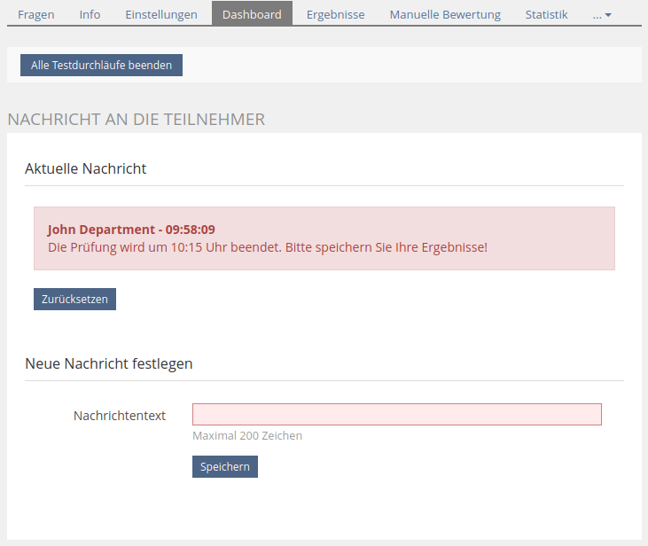

# ExamNotifications Plugin

ILIAS-Plugin für das Senden von Benachrichtigungen an Studierende während einer Klausur

## Nutzen

Während einer Prüfung können die Prüfenden den Studierenden Nachrichten zukommen lassen.
Die Funktion muss dabei nicht über Drittprogramme wie zum Beispiel Zoom bereitgestellt werden; sie ist in ILIAS integriert. Für den Text der Nachricht stehen 200 Zeichen zur Verfügung. Zusätzlich werden der Name des Absenders und die Uhrzeit ausgegeben, zu der die Nachricht festgelegt wurde.
Falls eine Nachricht festgelegt wurde, wird diese dem Prüfenden in einer Vorschau angezeigt.

Die Nachricht wird als andere Elemente überlagerndes Banner angezeigt, damit die Studierenden auf die Nachricht aufmerksam werden. Gleichzeitig ist es weniger aufdringlich als ein modales Dialogfenster und kann mit einem Klick geschlossen werden. Beim Aufrufen der nächsten Frage wird der Studierende durch ein erneutes Anzeigen an die Nachricht erinnert.

## Bedienung

### Für den Prüfenden
Die Nachricht wird pro Testobjekt auf dem Reiter _Dashboard_ eingestellt. Es kann immer nur eine Nachricht zur gleichen Zeit aktiv sein. Sobald eine Nachricht eingestellt wurde, kann diese dort auch zurückgesetzt werden.

*Beispiel für eine Nachricht im Dashboard:*



---

### Für die Studierenden
Die Nachricht wird in der Ansicht zur Bearbeitung einer Frage regelmäßig im Hintergrund abgefragt. Falls eine Nachricht eingestellt wurde, wird diese angezeigt.

*Beispiel für eine Nachricht in der Prüfungsansicht:*


## Kompatibilität

Das Plugin wurde ausschließlich mit Version 5.4 getestet.

**Empfehlung:** im Testobjekt sollte im Reiter _Einstellungen_ unter _Durchführung: Steuerung Testdurchlauf_ die _Prüfungsansicht_ aktiviert werden, damit die Darstellung in Kombination mit der ILIAS-Werkzeugleiste am oberen Rand harmoniert.

## Installation

Ausgehend vom ILIAS-Verzeichnis

```bash
mkdir -p Customizing/global/plugins/Services/UIComponent/UserInterfaceHook
cd Customizing/global/plugins/Services/UIComponent/UserInterfaceHook
git clone https://gitlab.fh-bielefeld.de/ilias/ExamNotifications.git ExamNotifications
```

## Konfiguration

### Abfragezeit

Die Abfragezeit (=Zeit, die maximal zwischen zwei Nachrichtenabfragen vergeht) kann im Konfigurationsbereich des Plugins auf einen Wert zwischen 5 und 300 Sekunden eingestellt werden.
